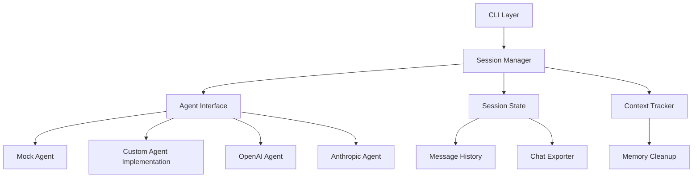
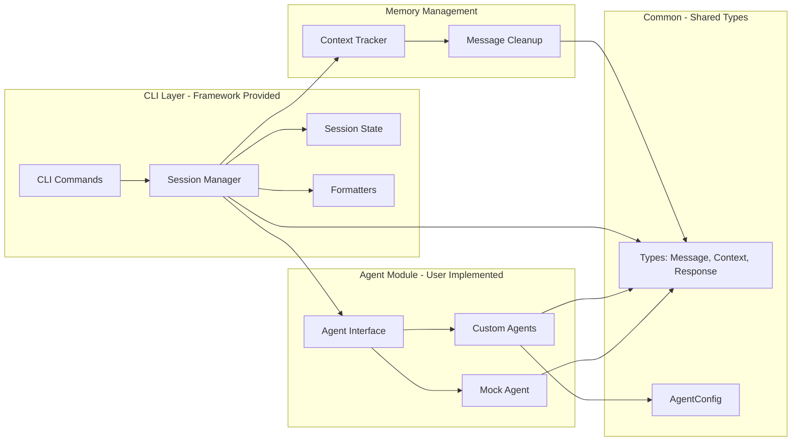
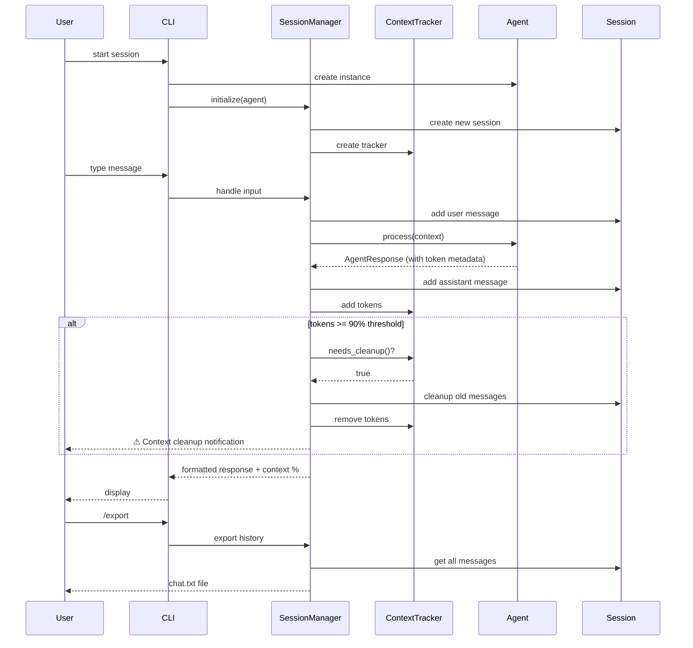
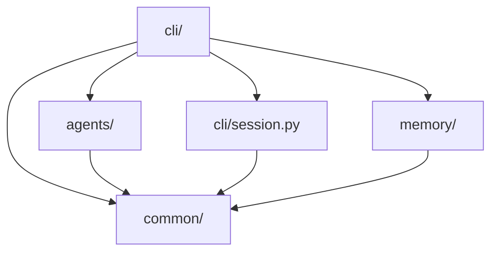

# Architecture

## Overview

The Agentic AI CLI Framework is a generic, pluggable framework for building and testing conversational AI agents. It provides a complete CLI interface with session management, message history, and conversation export - all while remaining completely agent-agnostic.

**For a quick introduction, see [getting-started.md](./getting-started.md).**

This document describes the core architecture, key design decisions, and how components interact.

## High-Level Architecture



## Component Architecture



## Data Flow



## Folder Structure

```
agentic-ai-cli/
├── src/
│   ├── agents/                    # Agent interface and base implementations
│   │   ├── __init__.py
│   │   ├── base.py               # AgentInterface (abstract)
│   │   └── mock_agent.py         # MockAgent for testing
│   │
│   ├── cli/                      # CLI interface (framework provided)
│   │   ├── __init__.py
│   │   ├── main.py              # Entry point, CLI commands
│   │   ├── session_manager.py   # Session orchestration
│   │   ├── session.py           # Session state management
│   │   ├── formatters.py        # Output formatting
│   │   ├── parser.py            # Command parsing
│   │   └── exporter.py          # Chat export formatting
│   │
│   ├── memory/                   # Context and memory management
│   │   ├── __init__.py
│   │   └── context_tracker.py   # Token tracking and cleanup
│   │
│   └── common/                   # Shared utilities
│       ├── __init__.py
│       ├── config.py            # AgentConfig
│       ├── exceptions.py        # Custom exceptions
│       └── types.py             # Message, AgentContext, AgentResponse
│
├── tests/
│   ├── agents/                  # Agent tests
│   ├── cli/                     # CLI tests
│   ├── common/                  # Common tests
│   └── fixtures/                # Test data and mocks
│
│
├── docs/
│   ├── getting-started.md           # Quick start guide
│   ├── architecture.md              # This file - core architecture
│   ├── developer-guide.md           # Implementation guide - TODO
│   ├── operations.md                # Security, performance, deployment - TODO
│   └── roadmap.md                   # Future enhancements - TODO
│
├── .env.example
├── .gitignore
├── CLAUDE.md                    # Instructions for Claude Code
├── pyproject.toml
└── README.md
```

## Key Architectural Decisions

### 1. Agent Interface, Not Provider Abstraction

**Decision**: Define a generic agent interface and let concrete implementations integrate directly with their chosen provider/framework.

**Rationale**:
- Provider abstraction creates maintenance overhead
- Different frameworks integrate with providers differently
- Developers can choose the best provider-framework combination per use case
- Reduces complexity and coupling
- Easier to optimize for specific provider capabilities

**Implementation**:
- `AgentInterface`: Generic abstract interface defining the contract
- Implementations: `async def process(context: AgentContext) -> AgentResponse`
- Each agent manages its own provider integration (optionally using `AgentConfig` convenience class)
- Framework provides `MockAgent` for testing

### 2. Stateless Agent Design

**Decision**: Agents do not maintain conversation history or session state.

**Rationale**:
- Makes agents truly portable (can be used in any context)
- Session state managed by CLI layer
- Same agent instance can handle multiple independent conversations
- Easier to test (no state to reset)
- Natural fit for microservice extraction or web deployment

**Implementation**:
- Agent receives full context on each call via `AgentContext`
- `AgentContext` includes: user input, conversation history, session ID, optional additional context
- SessionManager maintains state in CLI layer
- Agent is pure function: context in → response out

### 3. Agent Self-Configuration

**Decision**: Agents handle their own configuration and dependency loading.

**Rationale**:
- Makes agents truly independent and self-contained
- Agents can use any configuration strategy (env vars, config files, defaults)
- CLI doesn't need to know about agent-specific config needs
- Easier to use agents in different contexts (CLI, web, notebooks, batch)
- Each agent type can have different configuration requirements

**Implementation**:
- Agents accept optional parameters in constructor (with sensible defaults)
- Agents load their own environment variables or configuration
- Framework provides `AgentConfig` as optional convenience class in `common/`
- No singletons or global state
- CLI simply instantiates agents without knowing their internal config structure

### 4. CLI-Agent Boundary

**Decision**: Strict separation between CLI and agent code - agents cannot import from CLI package.

**Rationale**:
- Ensures agent portability
- Prevents accidental coupling
- Forces clean interface design
- Makes extraction to other contexts trivial (web, notebook, batch)

**Implementation**:
- Import linting rule: agents cannot import from `src.cli`
- Shared types in `src.common`
- CLI orchestrates, agent executes
- Agent has no knowledge of CLI existence

### 5. Simple Session Management

**Decision**: In-memory session storage with message history.

**Rationale**:
- Simple to implement and understand
- Fast operations
- No database dependencies
- Export to .txt provides archival option
- Sufficient for CLI use case and testing

**Implementation**:
- `Session` class manages message list
- Messages stored with role, content, and token count
- Export functionality built-in
- Future: can add persistence without changing agent interface

### 6. Context Window Management

**Decision**: Automatic token tracking with intelligent message cleanup.

**Rationale**:
- Long conversations can exceed LLM context windows
- Manual cleanup is tedious and error-prone
- Automatic cleanup maintains conversation coherence
- Predictable behavior with configurable thresholds
- Transparent to users with visual indicators

**Implementation**:
- `ContextTracker`: Monitors token usage as percentage of context window
- **Cleanup Threshold**: 90% usage triggers automatic cleanup
- **Target After Cleanup**: Reduce to 60% usage
- **Preservation Strategy**:
  - Never remove system messages
  - Always keep last N messages (default 5) for coherence
  - FIFO removal of older user/assistant messages
- **User Feedback**:
  - Visual context percentage after each response (color-coded: green <70%, yellow 70-89%, red ≥90%)
  - Notification when cleanup occurs
- **Configurable**: Context window size set at SessionManager initialization (default 100,000 tokens)

**Benefits**:
- Enables indefinitely long conversations
- No context overflow errors
- Maintains recent conversation context
- Users remain aware of memory usage

## Core Types

### Message
```python
class Message(BaseModel):
    role: str              # "user", "assistant", "system"
    content: str           # Message content
    tokens: int            # Token count (optional, for tracking)
```

### AgentContext
```python
class AgentContext(BaseModel):
    input: str                              # Current user input
    conversation_history: list[Message]     # Previous messages
    session_id: str                         # Session identifier
    additional_context: dict[str, Any] | None  # Optional domain-specific data
```

### AgentResponse
```python
class AgentResponse(BaseModel):
    output: str                     # Agent's response
    metadata: dict[str, Any]        # Additional metadata (usage, tokens, etc.)
```

### AgentConfig (Optional Convenience Class)
```python
class AgentConfig(BaseModel):
    system_prompt: str | None       # System prompt for the agent
    model: str | None               # Model name
    temperature: float              # Temperature setting
    max_tokens: int | None          # Max tokens for response
    api_key: str | None             # API key (if needed)
    # ... other config fields as needed by specific agents
```

**Note**: `AgentConfig` is provided as a convenience class in `common/` for agents to use internally if they wish. Agents are free to use it, extend it, or ignore it completely in favor of their own configuration approach.


## Module Dependencies



**Key Principle**: Dependency flow is one-way. Agent module depends only on common types, never on CLI.

## Design Philosophy Summary

1. **Generic over Specific**: No domain-specific code
2. **Composition over Configuration**: Inject agents, don't configure them
3. **Interface over Implementation**: Define contracts, let users implement
4. **Portability over Features**: Agents work anywhere, not just in CLI
5. **Simplicity over Completeness**: Provide essentials, let users extend

This framework is a **foundation**, not a complete solution. It handles the boring parts (CLI, session management, I/O) so you can focus on building great agents.
