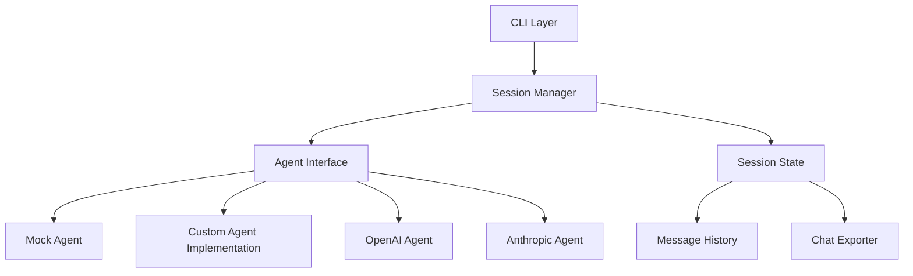
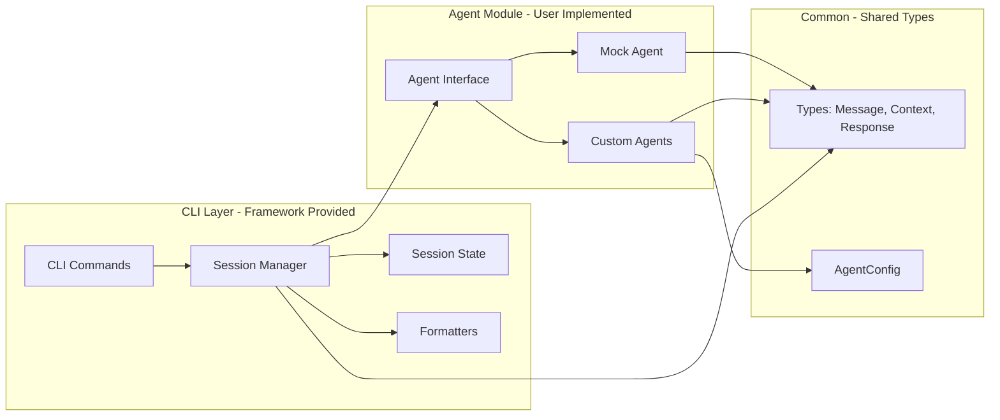
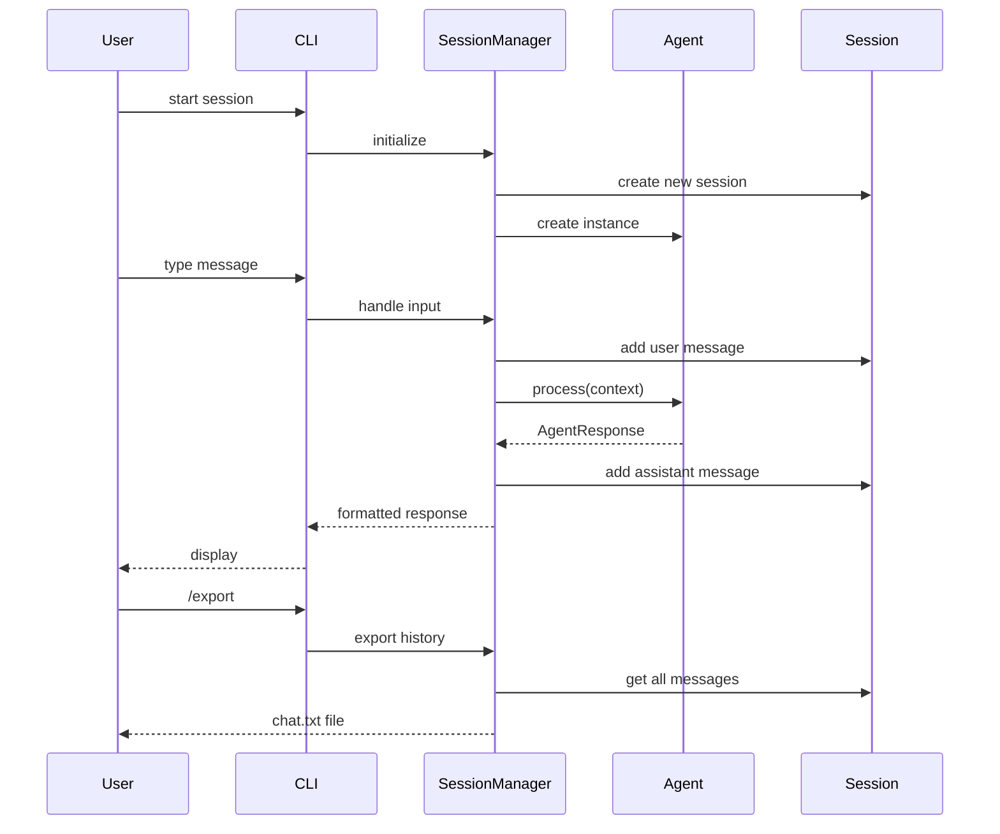
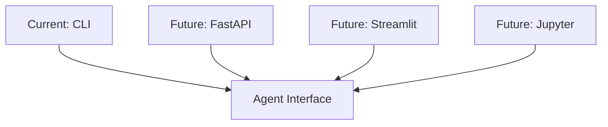
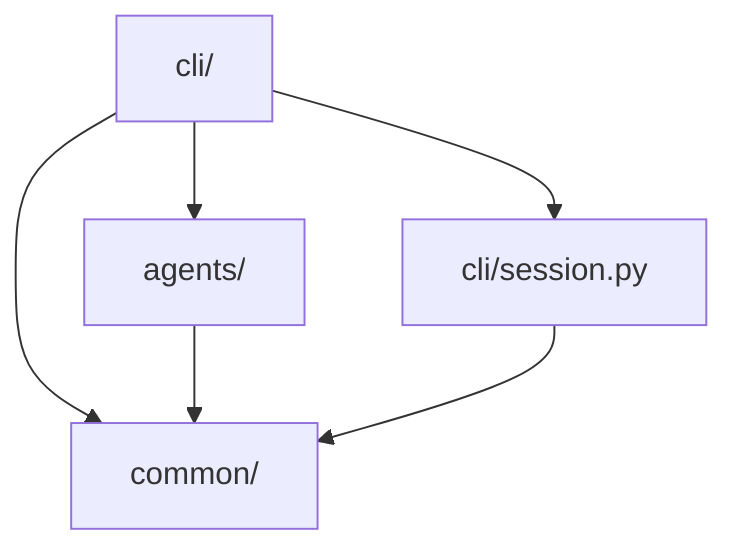

# Architecture - Agentic AI CLI Framework

## Overview

The Agentic AI CLI Framework is a generic, pluggable framework for building and testing conversational AI agents. It provides a complete CLI interface with session management, message history, and conversation export - all while remaining completely agent-agnostic.

This framework was extracted from a specialized AI Data Analyst CLI project, with all domain-specific functionality removed to create a reusable foundation for any agentic system.

## High-Level Architecture



## Component Architecture



## Data Flow



## Folder Structure

```
agentic-ai-cli/
├── src/
│   ├── agents/                    # Agent interface and base implementations
│   │   ├── __init__.py
│   │   ├── base.py               # AgentInterface (abstract)
│   │   └── mock_agent.py         # MockAgent for testing
│   │
│   ├── cli/                      # CLI interface (framework provided)
│   │   ├── __init__.py
│   │   ├── main.py              # Entry point, CLI commands
│   │   ├── session_manager.py   # Session orchestration
│   │   ├── session.py           # Session state management
│   │   ├── formatters.py        # Output formatting
│   │   ├── parser.py            # Command parsing
│   │   └── exporter.py          # Chat export formatting
│   │
│   └── common/                   # Shared utilities
│       ├── __init__.py
│       ├── config.py            # AgentConfig
│       ├── exceptions.py        # Custom exceptions
│       └── types.py             # Message, AgentContext, AgentResponse
│
├── tests/
│   ├── agents/                  # Agent tests
│   ├── cli/                     # CLI tests
│   ├── common/                  # Common tests
│   └── fixtures/                # Test data and mocks
│
│
├── docs/
│   ├── framework_architecture.md    # This file
│   ├── framework_development.md     # Migration and development plan
│   ├── architecture.md              # Original data analyst architecture (reference)
│   └── migration_plan.md            # Original migration guide (reference)
│
├── .env.example
├── .gitignore
├── CLAUDE.md                    # Instructions for Claude Code
├── pyproject.toml
└── README.md
```

## Key Architectural Decisions

### 1. Agent Interface, Not Provider Abstraction

**Decision**: Define a generic agent interface and let concrete implementations integrate directly with their chosen provider/framework.

**Rationale**:
- Provider abstraction creates maintenance overhead
- Different frameworks integrate with providers differently
- Developers can choose the best provider-framework combination per use case
- Reduces complexity and coupling
- Easier to optimize for specific provider capabilities

**Implementation**:
- `AgentInterface`: Generic abstract interface defining the contract
- Implementations: `async def process(context: AgentContext) -> AgentResponse`
- Each agent manages its own provider integration via `AgentConfig`
- Framework provides `MockAgent` for testing

### 2. Stateless Agent Design

**Decision**: Agents do not maintain conversation history or session state.

**Rationale**:
- Makes agents truly portable (can be used in any context)
- Session state managed by CLI layer
- Same agent instance can handle multiple independent conversations
- Easier to test (no state to reset)
- Natural fit for microservice extraction or web deployment

**Implementation**:
- Agent receives full context on each call via `AgentContext`
- `AgentContext` includes: user input, conversation history, session ID, optional additional context
- SessionManager maintains state in CLI layer
- Agent is pure function: context in → response out

### 3. Dependency Injection Throughout

**Decision**: All dependencies passed via constructors, no global state.

**Rationale**:
- Makes code testable (easy to inject mocks)
- Explicit dependencies improve code clarity
- Enables runtime configuration
- Required for true portability

**Implementation**:
- Agents receive `AgentConfig` in constructor
- No environment variable reading in agent code
- No singletons or global state
- CLI layer handles config loading from environment

### 4. CLI-Agent Boundary

**Decision**: Strict separation between CLI and agent code - agents cannot import from CLI package.

**Rationale**:
- Ensures agent portability
- Prevents accidental coupling
- Forces clean interface design
- Makes extraction to other contexts trivial (web, notebook, batch)

**Implementation**:
- Import linting rule: agents cannot import from `src.cli`
- Shared types in `src.common`
- CLI orchestrates, agent executes
- Agent has no knowledge of CLI existence

### 5. Simple Session Management

**Decision**: In-memory session storage with message history.

**Rationale**:
- Simple to implement and understand
- Fast operations
- No database dependencies
- Export to .txt provides archival option
- Sufficient for CLI use case and testing

**Implementation**:
- `Session` class manages message list
- Messages stored with role, content, and token count
- Export functionality built-in
- Future: can add persistence without changing agent interface

## Core Types

### Message
```python
class Message(BaseModel):
    role: str              # "user", "assistant", "system"
    content: str           # Message content
    tokens: int            # Token count (optional, for tracking)
```

### AgentContext
```python
class AgentContext(BaseModel):
    input: str                              # Current user input
    conversation_history: list[Message]     # Previous messages
    session_id: str                         # Session identifier
    additional_context: dict[str, Any] | None  # Optional domain-specific data
```

### AgentResponse
```python
class AgentResponse(BaseModel):
    output: str                     # Agent's response
    metadata: dict[str, Any]        # Additional metadata (usage, tokens, etc.)
```

### AgentConfig
```python
class AgentConfig(BaseModel):
    system_prompt: str | None       # System prompt for the agent
    model: str | None               # Model name
    temperature: float              # Temperature setting
    max_tokens: int | None          # Max tokens for response
    api_key: str | None             # API key (if needed)
    # ... other config fields
```

## Portability Guidelines

### What Makes the Framework Portable

1. **Zero Domain Dependencies**: No domain-specific code in the framework
2. **Clear Interfaces**: Well-defined input/output contracts
3. **Stateless Agents**: No instance variables that accumulate state
4. **Constructor Injection**: All configuration passed at initialization
5. **CLI Independence**: Agents work without CLI layer

### Example: Using Agents Outside CLI

**In a FastAPI Service**:
```python
from src.agents.custom_agent import MyAgent
from src.common.config import AgentConfig
from src.common.types import AgentContext

config = AgentConfig(system_prompt="...", model="gpt-4", api_key=api_key)
agent = MyAgent(config)

@app.post("/chat")
async def chat(message: str, session_id: str):
    context = AgentContext(
        input=message,
        conversation_history=load_history(session_id),
        session_id=session_id
    )
    response = await agent.process(context)
    save_message(session_id, "assistant", response.output)
    return {"response": response.output}
```

**In a Jupyter Notebook**:
```python
from src.agents.custom_agent import MyAgent
from src.common.config import AgentConfig
from src.common.types import AgentContext

agent = MyAgent(AgentConfig(system_prompt="...", api_key="..."))

context = AgentContext(
    input="What is the meaning of life?",
    conversation_history=[],
    session_id="notebook_session"
)

response = await agent.process(context)
print(response.output)
```

**In a Batch Script**:
```python
for query in queries:
    context = AgentContext(
        input=query,
        conversation_history=[],
        session_id=f"batch_{i}"
    )
    response = await agent.process(context)
    save_result(response.output)
```

## Configuration Strategy

### Environment Variables (CLI Level)
Used by CLI to instantiate agents with proper credentials:
- `ANTHROPIC_API_KEY`
- `OPENAI_API_KEY`
- `DEFAULT_MODEL`
- `DEFAULT_TEMPERATURE`
- `DEFAULT_MAX_TOKENS`

### Configuration Objects (Agent Level)
Passed to agent constructors:
- `AgentConfig`: Agent-specific settings
- Runtime configuration, not environment-dependent
- Allows multiple agents with different configs in same process

## Testing Strategy

### Framework Testing
- **Unit Tests**: Mock agents, test CLI logic
- **Integration Tests**: End-to-end with mock agent
- **Coverage Target**: 80%+ for framework code

### Agent Testing (User Responsibility)
- Users test their own agent implementations
- Framework provides `MockAgent` for testing CLI integrations
- Example tests provided for reference

## Extensibility Points

### Adding New Agent Implementations

This is the primary use case for the framework:

1. Create new agent class inheriting from `AgentInterface`
2. Implement `async def process(context: AgentContext) -> AgentResponse`
3. Accept `AgentConfig` in constructor
4. Choose LLM provider and integrate directly
5. Choose agentic framework (Agno, LangGraph, CrewAI, etc.) or go framework-less
6. Write tests
7. Instantiate and pass to `SessionManager`

Example:
```python
from src.agents.base import AgentInterface
from src.common.types import AgentContext, AgentResponse
from src.common.config import AgentConfig

class MyCustomAgent(AgentInterface):
    def __init__(self, config: AgentConfig):
        self.config = config
        # Initialize your LLM client, framework, etc.

    async def process(self, context: AgentContext) -> AgentResponse:
        # Your agent logic here
        # Access context.input, context.conversation_history, etc.
        # Call your LLM, run your framework, etc.
        return AgentResponse(
            output="Your response",
            metadata={"model": "...", "tokens": 123}
        )
```

### Extending the CLI (Less Common)

The CLI is meant to be stable, but you can:
- Add new commands in `parser.py` and `session_manager.py`
- Customize formatters in `formatters.py`
- Add new export formats in `exporter.py`

### Post-MVP Enhancements

Future framework enhancements could include:
- Streaming response support
- Conversation summarization
- Persistent session storage (SQLite, Redis)
- Token/cost tracking
- Multi-session management
- Plugin system
- Web UI alternative to CLI

## Security Considerations

### API Key Management
- Store in `.env` file (never commit)
- Load at CLI level or in agent implementations
- Pass to agents via `AgentConfig`
- No hardcoded keys

### Input Validation
- User input validated before processing
- Type checking via Pydantic throughout
- Agents should sanitize their own inputs for their specific providers

## Performance Considerations

### Response Time
- Async operations throughout
- Agents can implement streaming (framework supports it)
- Connection pooling responsibility of agent implementations

### Memory Usage
- Sessions stored in memory during runtime
- No automatic cleanup (CLI sessions are short-lived)
- Export and exit to clear memory
- Future: configurable message limits

## Future Architecture Evolution

### From CLI to Web Service



The agent implementations remain unchanged. Only the orchestration layer changes.

### Scaling Considerations
- Stateless agents enable horizontal scaling
- Session state could move to Redis
- Agent instances can be pooled
- Rate limiting at service boundary
- Load balancing across instances

## Module Dependencies



**Key Principle**: Dependency flow is one-way. Agent module depends only on common types, never on CLI.

## Design Philosophy Summary

1. **Generic over Specific**: No domain-specific code
2. **Composition over Configuration**: Inject agents, don't configure them
3. **Interface over Implementation**: Define contracts, let users implement
4. **Portability over Features**: Agents work anywhere, not just in CLI
5. **Simplicity over Completeness**: Provide essentials, let users extend

This framework is a **foundation**, not a complete solution. It handles the boring parts (CLI, session management, I/O) so you can focus on building great agents.
