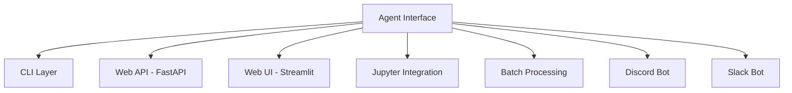

# Roadmap

This document outlines potential future enhancements and the evolution path for the Agentic AI CLI Framework.

**Status**: Planning document - features listed here are not yet implemented.

## Table of Contents

- [Post-MVP Enhancements](#post-mvp-enhancements)
- [Architecture Evolution](#architecture-evolution)
- [Scaling Considerations](#scaling-considerations)

---

## Post-MVP Enhancements

These features could enhance the framework while maintaining its core simplicity and portability.

### Streaming Response Support

**Goal**: Enable real-time streaming of agent responses.

**Current State**: Agents can stream internally, but CLI doesn't display streaming.

**Enhancement**:
```python
class AgentInterface(ABC):
    @abstractmethod
    async def process(self, context: AgentContext) -> AgentResponse:
        """Standard batch processing"""
        pass

    async def process_stream(self, context: AgentContext) -> AsyncIterator[str]:
        """Optional streaming support"""
        # Default implementation: yield full response at once
        response = await self.process(context)
        yield response.output
```

**Benefits**:
- Better UX for long responses
- Lower perceived latency
- Enables progressive rendering in web UIs

**Implementation**:
- Add optional `process_stream()` method to `AgentInterface`
- Update CLI to detect and handle streaming
- Provide streaming examples for web deployments

---

### Conversation Summarization

**Goal**: AI-powered context compression to extend conversation length.

**Challenge**: Long conversations exceed context windows even with cleanup.

**Solution**: Summarize old messages instead of deleting them.

```python
class ContextTracker:
    async def summarize_history(
        self,
        messages: list[Message],
        summarizer_agent: AgentInterface
    ) -> Message:
        """Summarize a range of messages into a single summary message"""
        # Use a lightweight agent to create summary
        summary_context = AgentContext(
            input="Summarize this conversation segment",
            conversation_history=messages,
            session_id="summary"
        )
        summary_response = await summarizer_agent.process(summary_context)

        return Message(
            role="system",
            content=f"[Summary]: {summary_response.output}",
            tokens=summary_response.metadata.get("tokens", 0)
        )
```

**Benefits**:
- Maintain context from very long conversations
- More intelligent than FIFO deletion
- Configurable summarization strategy

**Considerations**:
- Adds complexity and cost (extra LLM calls)
- Need to balance summarization frequency
- Should be opt-in, not default

---

### Persistent Session Storage

**Goal**: Sessions survive application restarts.

**Current State**: In-memory only (cleared on exit).

**Options**:

**SQLite** (Simple, local):
```python
class SQLiteSessionStore:
    def __init__(self, db_path: str = "sessions.db"):
        self.db = sqlite3.connect(db_path)
        self._init_schema()

    def save_session(self, session: Session):
        # Store messages in database
        pass

    def load_session(self, session_id: str) -> Session:
        # Retrieve from database
        pass
```

**Redis** (Distributed, production-ready):
```python
class RedisSessionStore:
    def __init__(self, redis_url: str):
        self.redis = redis.from_url(redis_url)

    async def save_session(self, session: Session):
        await self.redis.setex(
            f"session:{session.id}",
            3600,  # 1 hour TTL
            json.dumps([m.dict() for m in session.messages])
        )
```

**Benefits**:
- Resume conversations after restarts
- Share sessions across instances (Redis)
- Archival and analytics

**Implementation**:
- Create `SessionStore` interface
- Implement SQLite and Redis backends
- Make storage backend configurable in `SessionManager`

---

### Enhanced Cost Tracking

**Goal**: Per-message and per-session cost calculation.

**Current State**: Token counts tracked, but no cost calculation.

**Enhancement**:
```python
class CostTracker:
    PRICING = {
        "gpt-4": {"input": 0.03, "output": 0.06},
        "gpt-3.5-turbo": {"input": 0.0015, "output": 0.002},
        "claude-3-opus": {"input": 0.015, "output": 0.075}
    }

    def calculate_cost(
        self,
        model: str,
        prompt_tokens: int,
        completion_tokens: int
    ) -> float:
        pricing = self.PRICING.get(model, {"input": 0, "output": 0})
        input_cost = (prompt_tokens / 1000) * pricing["input"]
        output_cost = (completion_tokens / 1000) * pricing["output"]
        return input_cost + output_cost

    def get_session_cost(self, session: Session) -> float:
        # Calculate total cost for session
        pass
```

**Benefits**:
- Budget awareness and tracking
- Cost optimization insights
- Billing and chargeback

---

### Multi-Session Management

**Goal**: Switch between multiple active sessions.

**Use Case**: Testing multiple agent configurations or managing multiple conversations.

```bash
# CLI commands
/sessions                # List active sessions
/session new             # Create new session
/session switch <id>     # Switch to different session
/session delete <id>     # Delete a session
```

**Implementation**:
- Update `SessionManager` to handle multiple sessions
- Add session switching logic
- Persist session metadata

---

### Plugin System

**Goal**: Extensible architecture for community plugins.

**Concept**:
```python
class Plugin(ABC):
    @abstractmethod
    def on_message_sent(self, message: Message):
        """Hook: before message sent to agent"""
        pass

    @abstractmethod
    def on_message_received(self, message: Message):
        """Hook: after response received"""
        pass

# Example plugin
class LoggingPlugin(Plugin):
    def on_message_sent(self, message: Message):
        logger.info(f"User: {message.content}")

    def on_message_received(self, message: Message):
        logger.info(f"Assistant: {message.content}")

# Usage
session_manager = SessionManager(
    agent=agent,
    plugins=[LoggingPlugin(), CostTrackingPlugin()]
)
```

**Benefits**:
- Community extensions
- Custom analytics and logging
- Domain-specific enhancements

---

### Web UI Alternative

**Goal**: Provide web-based UI alongside CLI.

**Approach**: Keep agents portable, add web interface as alternative orchestration layer.

**Tech Stack Options**:
- **FastAPI** + **React**: Full-featured SPA
- **Streamlit**: Rapid prototyping, simpler deployment
- **Gradio**: Minimal setup, great for demos

**Example (Streamlit)**:
```python
import streamlit as st
from src.agents.my_agent import MyAgent

agent = MyAgent()

st.title("Agent Chat")

if "messages" not in st.session_state:
    st.session_state.messages = []

for msg in st.session_state.messages:
    st.chat_message(msg["role"]).write(msg["content"])

if prompt := st.chat_input():
    st.session_state.messages.append({"role": "user", "content": prompt})
    st.chat_message("user").write(prompt)

    context = AgentContext(
        input=prompt,
        conversation_history=[Message(**m) for m in st.session_state.messages],
        session_id="streamlit"
    )

    response = await agent.process(context)
    st.session_state.messages.append({"role": "assistant", "content": response.output})
    st.chat_message("assistant").write(response.output)
```

---

### Configurable Cleanup Strategies

**Goal**: More intelligent message cleanup beyond FIFO.

**Current State**: FIFO removal of old messages.

**Enhancements**:

**Importance-Based**:
```python
def calculate_importance(message: Message) -> float:
    """Score message importance (0-1)"""
    # Longer messages might be more important
    # System messages always important
    # Recent messages more important
    # Messages with keywords more important
    pass

def cleanup_by_importance(messages: list[Message], target_tokens: int):
    """Remove least important messages first"""
    scored = [(msg, calculate_importance(msg)) for msg in messages]
    scored.sort(key=lambda x: x[1])
    # Remove lowest-scoring until target reached
```

**Recency-Weighted**:
```python
def cleanup_weighted(messages: list[Message], target_tokens: int):
    """Keep more recent messages, some older context"""
    # Always keep last N messages
    # Keep summary of older messages
    # Remove middle messages first
    pass
```

**Semantic Clustering**:
```python
async def cleanup_semantic(messages: list[Message], target_tokens: int):
    """Group similar messages, keep representatives"""
    # Use embeddings to cluster similar messages
    # Keep one message per cluster
    # Preserve conversation flow
    pass
```

---

## Architecture Evolution

### From CLI to Multi-Interface

**Vision**: Same agents, multiple interfaces.



**Key Principle**: Agents remain unchanged. Only orchestration layer changes.

**Timeline**:
1. **Phase 1** (Current): CLI implementation
2. **Phase 2**: Add FastAPI web service
3. **Phase 3**: Add Streamlit or Gradio UI
4. **Phase 4**: Chat platform integrations

---

### Microservice Extraction

**Goal**: Extract agents as standalone microservices.

**Architecture**:

```
┌─────────────┐      ┌─────────────┐      ┌─────────────┐
│   Web App   │      │     CLI     │      │ Discord Bot │
└──────┬──────┘      └──────┬──────┘      └──────┬──────┘
       │                    │                     │
       └────────────────────┼─────────────────────┘
                            │
                     ┌──────▼──────┐
                     │  API Gateway │
                     └──────┬──────┘
                            │
       ┌────────────────────┼────────────────────┐
       │                    │                    │
┌──────▼──────┐      ┌──────▼──────┐      ┌─────▼──────┐
│  Agent A    │      │  Agent B    │      │  Agent C   │
│ Microservice│      │ Microservice│      │Microservice│
└─────────────┘      └─────────────┘      └────────────┘
```

**Benefits**:
- Independent scaling per agent
- Language-agnostic (agents can be in any language)
- Deploy and update agents independently
- Service mesh integration

**Migration Path**:
1. Agents already portable (just add HTTP wrapper)
2. Standardize API contract (REST or gRPC)
3. Add service discovery
4. Deploy behind API gateway

---

## Scaling Considerations

### Horizontal Scaling

**Current State**: Single-process CLI application.

**Future State**: Distributed, load-balanced agent services.

**Requirements**:
- ✅ Stateless agents (already implemented)
- ✅ Portable agents (already implemented)
- 🔲 Shared session storage (Redis/database)
- 🔲 Load balancing
- 🔲 Health checks and monitoring

**Architecture**:

```
             ┌─────────────┐
             │Load Balancer│
             └──────┬──────┘
                    │
        ┌───────────┼───────────┐
        │           │           │
   ┌────▼───┐  ┌───▼────┐  ┌───▼────┐
   │Agent   │  │Agent   │  │Agent   │
   │Instance│  │Instance│  │Instance│
   │   1    │  │   2    │  │   3    │
   └────┬───┘  └───┬────┘  └───┬────┘
        │          │           │
        └──────────┼───────────┘
                   │
            ┌──────▼──────┐
            │    Redis    │
            │(Session Store)│
            └─────────────┘
```

### Rate Limiting

**Goal**: Protect against abuse and manage costs.

**Implementation Levels**:

**Per-User**:
```python
from slowapi import Limiter
from slowapi.util import get_remote_address

limiter = Limiter(key_func=get_remote_address)

@app.post("/chat")
@limiter.limit("10/minute")
async def chat(request: Request, message: str):
    # Process with rate limit
    pass
```

**Per-Session**:
```python
# Track requests per session
session_limits = {}

async def check_session_limit(session_id: str):
    if session_id not in session_limits:
        session_limits[session_id] = {"count": 0, "reset": time.time() + 3600}

    if time.time() > session_limits[session_id]["reset"]:
        session_limits[session_id] = {"count": 0, "reset": time.time() + 3600}

    if session_limits[session_id]["count"] >= 100:
        raise RateLimitExceeded("Session rate limit exceeded")

    session_limits[session_id]["count"] += 1
```

**Token-Based**:
```python
# Rate limit based on token consumption
async def check_token_quota(user_id: str, estimated_tokens: int):
    daily_usage = await get_daily_usage(user_id)
    daily_quota = 100000  # 100k tokens per day

    if daily_usage + estimated_tokens > daily_quota:
        raise QuotaExceeded("Daily token quota exceeded")
```

---

## Contributing to the Roadmap

Have ideas for the framework? We'd love to hear them!

- **Open an Issue**: Describe your feature request
- **Start a Discussion**: Propose architectural changes
- **Submit a PR**: Implement a feature from this roadmap

**Criteria for New Features**:
- ✅ Maintains agent portability
- ✅ Preserves framework simplicity
- ✅ Provides clear value
- ✅ Well-tested and documented
- ✅ Backward compatible (or clearly breaking)

---

## Timeline (Tentative)

This is a community-driven project. Timeline depends on contributions and priorities.

**Near Term** (0-3 months):
- Persistent session storage (SQLite)
- Enhanced cost tracking
- Streaming support in CLI

**Medium Term** (3-6 months):
- FastAPI web service example
- Multi-session management
- Conversation summarization

**Long Term** (6+ months):
- Plugin system
- Web UI (Streamlit/Gradio)
- Microservice deployment guides
- Chat platform integrations

---

## Next Steps

- **Get Started**: See [getting-started.md](./getting-started.md) to begin using the framework
- **Understand Architecture**: Read [architecture.md](./architecture.md) for design details
- **Build Agents**: Follow [developer-guide.md](./developer-guide.md) for implementation
- **Deploy**: Check [operations.md](./operations.md) for production guidance
